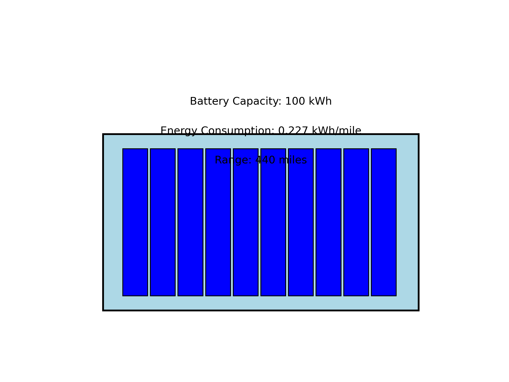
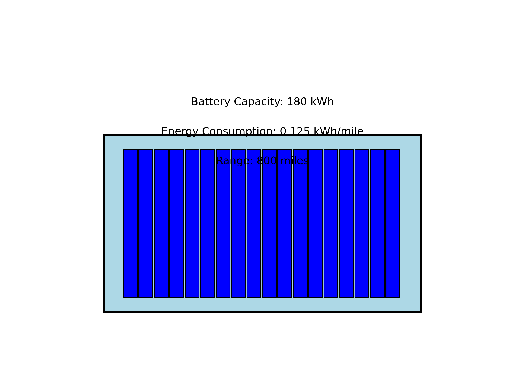

# Tesla Battery Range Optimization Prototype

## Overview
This project simulates the current performance of a Tesla car battery (440-mile range) and models improvements to achieve an 800-mile range. The goal is to demonstrate how advancements in battery capacity, energy efficiency, and 
driving behavior can extend the range of electric vehicles.

## Current Tesla Battery
The current Tesla Model S Long Range has the following specifications:
- **Battery Capacity**: 100 kWh
- **Energy Consumption**: 0.227 kWh/mile
- **Range**: ~440 miles
- **Driving Conditions**:
  - Speed: 50–80 mph
  - Temperature: -10°C to 40°C
  - Terrain: Flat and hilly

While this range is impressive, there is room for improvement to meet the growing demand for longer-range electric vehicles.

## Proposed Improvements
To achieve an 800-mile range, we propose the following improvements:
1. **Increased Battery Capacity**: From 100 kWh to 180 kWh.
   - This involves advancements in battery technology, such as higher energy-density cells or more efficient battery packs.
2. **Reduced Energy Consumption**: From 0.227 kWh/mile to 0.125 kWh/mile.
   - Achieved through:
     - Aerodynamic design improvements.
     - Optimized motor efficiency.
     - Regenerative braking enhancements.
3. **Optimized Driving Behavior**:
   - Speed: Reduced from 50–80 mph to 40–60 mph for better efficiency.
   - Temperature: Maintained between 10°C and 30°C to minimize thermal losses.
   - Terrain: Limited to flat terrain to reduce energy consumption.

These improvements result in a theoretical range of ~800 miles.

## Prototype Visualization
Below are visual prototypes of the current Tesla battery and the improved version:

### Current Tesla Battery


### Improved Tesla Battery


These diagrams represent the structural and performance differences between the current and improved batteries.

## Repository Structure
- `simulate_current_performance.py`: Simulates the current Tesla battery performance.
- `simulate_improved_performance.py`: Models the improvements needed for an 800-mile range.
- `visualize_results.py`: Visualizes the comparison between current and improved performance.
- `current_battery_performance.csv`: Simulated data for the current battery performance.
- `improved_battery_performance.csv`: Simulated data for the improved battery performance.
- `requirements.txt`: Lists all Python dependencies.

## Installation

1. Clone this repository:
   ```bash
   git clone git@github.com:adams20023/tesla_battery.git
   cd tesla_battery

2. Set up a virtual environment:
   python3 -m venv venv
   source venv/bin/activate

3. Install dependencies:
   pip install -r requirements.txt

Usage

1. Run the simulation for the current battery performance:
  
   python simulate_current_performance.py

2. Run the simulation for the improved battery performance:

   python simulate_improved_performance.py

3. Visualize the results:

   python visualize_results.py

Results

1. Current Battery Performance

 Battery Capacity : 100 kWh
 Energy Consumption : 0.227 kWh/mile
 Range : ~440 miles

2. Improved Battery Performance

 Battery Capacity : 180 kWh
 Energy Consumption : 0.125 kWh/mile
 Range : ~800 miles

Contributing

Contributions are welcome! Please open an issue or submit a pull request.

License

This project is licensed under the MIT License. See the LICENSE file for details.
